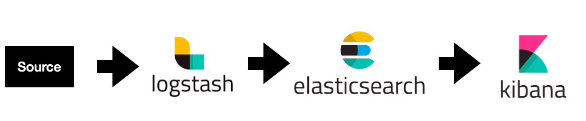

# 8주차 과제


## 과제 설명 (총 20점)
8주차 과제의 진행방식은 다음과 같습니다.
1. 로컬에서 Elasticsearch 환경 구성하기
2. t2.medium에 logstash 환경 구성하기
3. 로컬에서 logstash로 가상의 데이터 보내기
4. Kibana에 대쉬보드 그리기

## 제출 방법
### 1. 로컬환경에서 수정 후 EC2 인스턴스에 배포
```
git pull
<수정작업>
git add .
git commit -m "Submit assignment 8"
git push origin master
```


## 질문
### 1. 본인의 Kibana 주소를 알려주세요
- 주소: 
- 계정:
- 비번:
### 2. 기타 코멘트
여기에 작성

## 피드백
이 부분은 강사가 작성하는 부분입니다.
